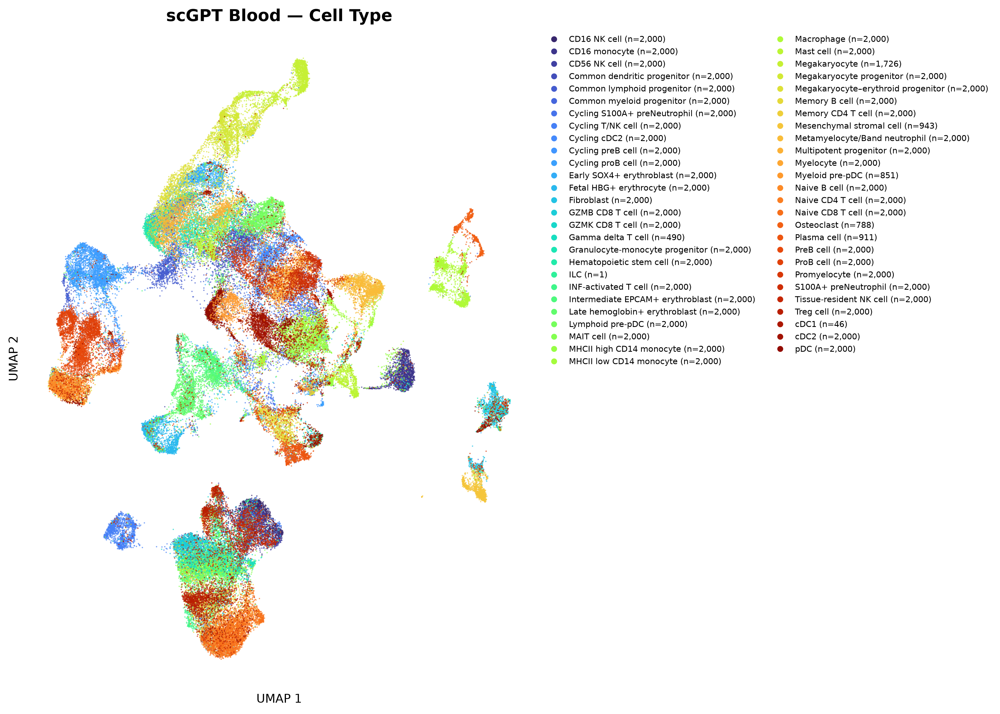
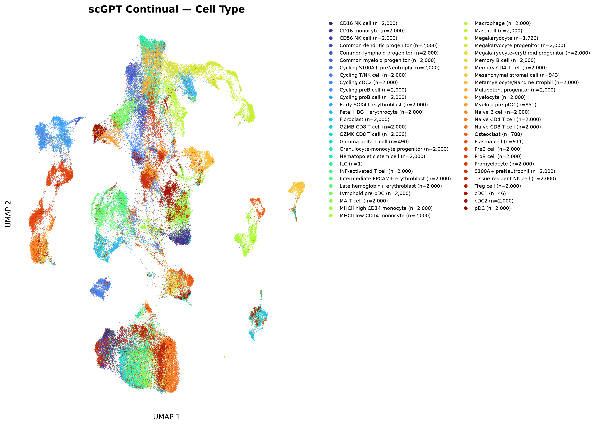
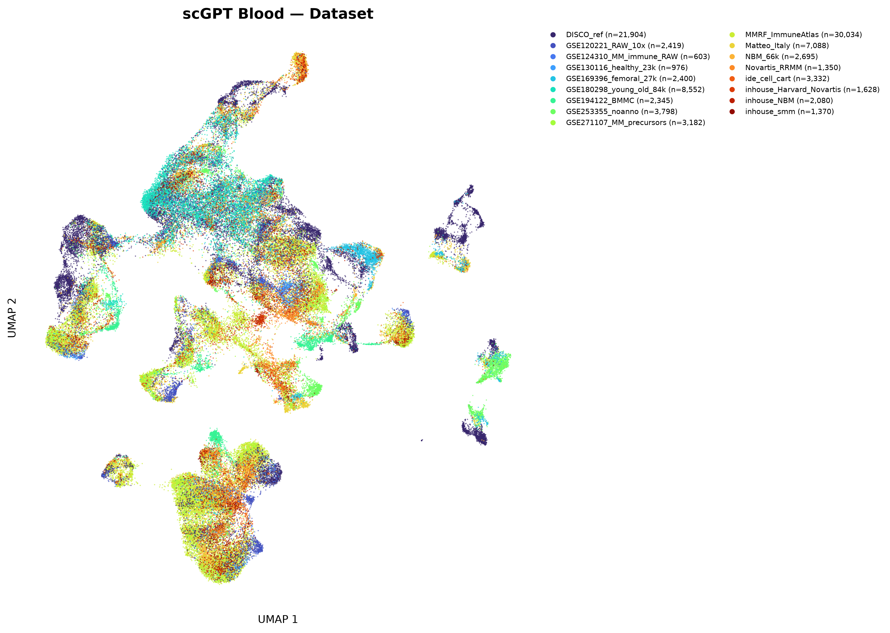
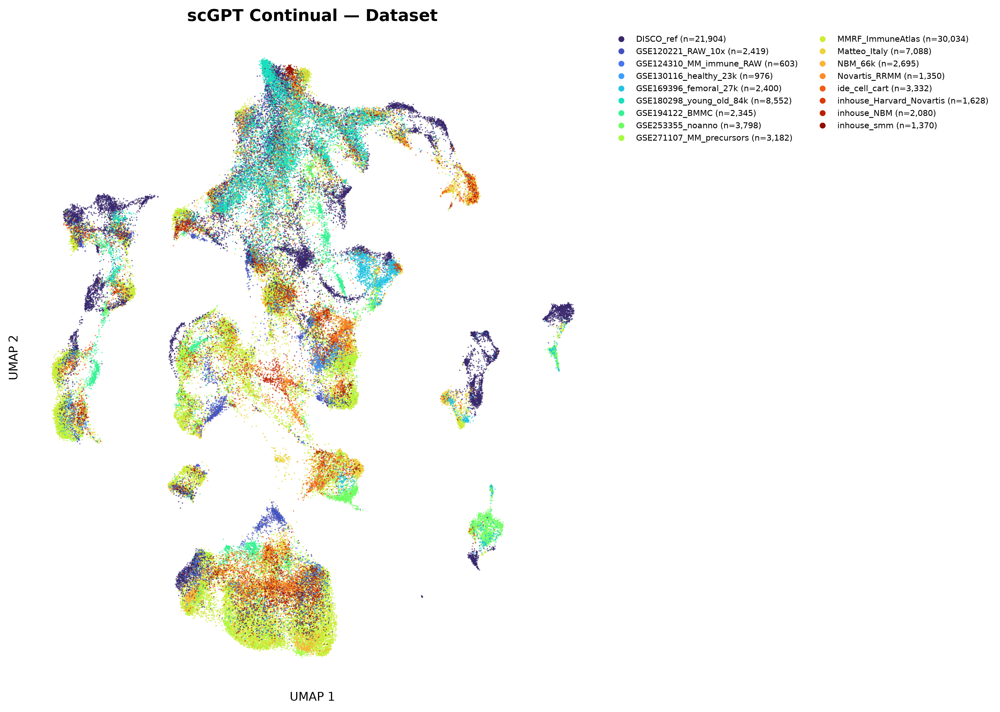
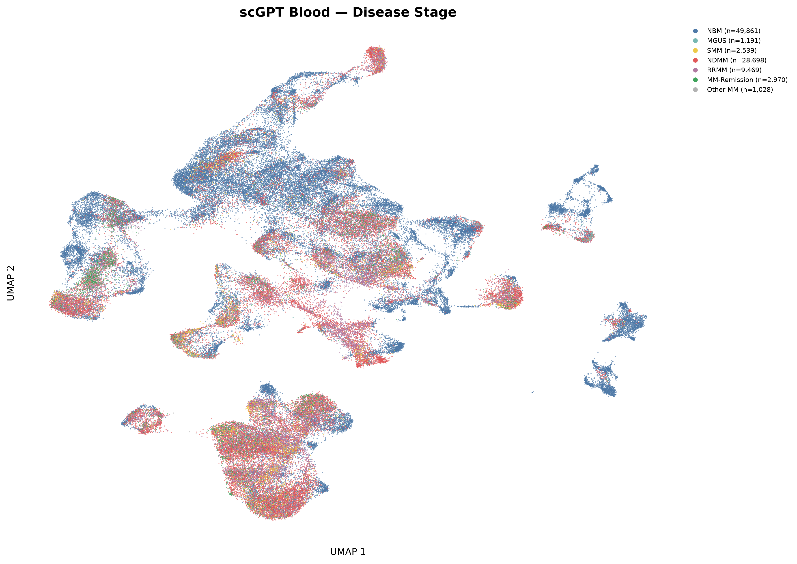
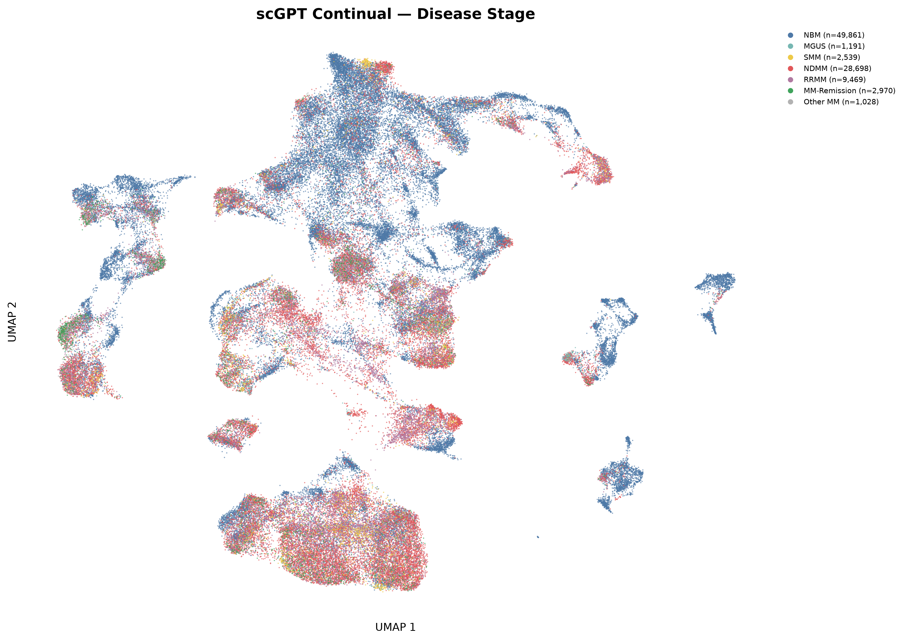
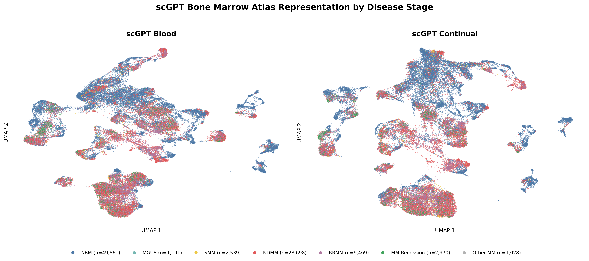

# scGPT Bone Marrow Immune Atlas

This repository contains scGPT embedding, checkpoint benchmarking, and cell-type annotation workflows developed for a **3,041,619-cell bone marrow immune atlas**.

The atlas provides the biological and statistical foundation of the project: observed expression, curated cell states, patients, cohorts, disease stages, and dataset provenance. scGPT adds a learned representation layer that can be evaluated against that foundation.

## Scientific scope

We are testing whether pretrained single-cell representations preserve biologically meaningful structure across a large, heterogeneous collection of bone marrow datasets.

The current work evaluates:

- cell-type organization in scGPT embedding space;
- integration across contributing datasets;
- transfer learning for cell-type annotation;
- checkpoint-specific differences in representation quality;
- disease-stage organization;
- and the reproducibility of learned features across cohorts.

These analyses treat scGPT embeddings as quantitative biological representations that require independent validation. UMAP structure alone does not establish biological validity, statistical significance, disease progression, or therapeutic relevance.

## Current capabilities

The repository includes workflows for:

- chunked scGPT embedding generation;
- checkpoint benchmarking;
- neighborhood-purity analysis;
- dataset-mixing analysis;
- supervised cell-type annotation;
- disease-stage visualization;
- aggregate metric generation;
- and command-line execution.

The v2 cell-type annotation workflow is used as the canonical implementation.

## Checkpoints evaluated

Two pretrained scGPT checkpoints were evaluated:

- **Blood**
- **Continual pretraining**

The continual-pretrained checkpoint produced stronger local cell-type purity in the current benchmark.

The blood checkpoint produced somewhat stronger mixing across contributing datasets.

This does not identify a universal best checkpoint. The checkpoints preserve different aspects of the atlas, and their value depends on the downstream task.

## Representation evidence

### Cell-type organization

| Blood checkpoint | Continual-pretrained checkpoint |
|---|---|
|  |  |

The continual-pretrained embedding shows stronger local organization of curated immune populations. The blood checkpoint preserves the broad structure of the atlas while producing a different balance between local cell-type separation and cross-dataset integration.

### Dataset mixing

| Blood checkpoint | Continual-pretrained checkpoint |
|---|---|
|  |  |

The blood checkpoint shows somewhat stronger mixing among contributing datasets.

Dataset mixing must be interpreted together with biological conservation. Complete mixing is not automatically desirable when datasets differ in cell composition, disease stage, tissue handling, sequencing platform, or cohort design.

### Disease-stage structure

| Blood checkpoint | Continual-pretrained checkpoint |
|---|---|
|  |  |

Disease-stage overlays show how healthy bone marrow, precursor disease, newly diagnosed multiple myeloma, relapsed disease, and remission samples are distributed across the learned representations.

These plots are descriptive. Stage-dependent biological claims require patient-level inference, dataset-aware modeling, replication, and explicit confounding assessment.

### Direct stage comparison



UMAP compresses a high-dimensional representation into two dimensions. The quantitative benchmark therefore evaluates neighborhood composition, annotation performance, and dataset mixing in addition to visual inspection.

## Role of scGPT in the atlas

scGPT provides learned cell representations that can be used alongside the measured atlas.

The representation layer can support:

- transfer of cell-state labels;
- comparison of related immune populations;
- identification of features that generalize across datasets;
- analysis of disease-associated geometry;
- and prediction of how gene-level perturbations may alter cellular state.

The measured atlas remains the source of truth. Learned representations are evaluated against curated annotations, patient structure, dataset provenance, disease stage, and deterministic statistical results.

## Perturbational analysis

A major next step is to evaluate whether scGPT can support perturbational target prioritization.

The proposed analysis will identify genes, pathways, and regulatory programs whose modeled perturbation shifts pathological immune states toward healthy reference states or away from disease-associated states.

Each candidate will be evaluated through parallel evidence branches:

- patient-level differential expression;
- leave-one-dataset-out robustness;
- disease-stage consistency;
- transcription-factor and regulatory-network context;
- representation-space perturbation;
- pathway-level coherence;
- and external or experimental validation.

A predicted movement in embedding space will be treated as a hypothesis, not as causal evidence.

Embedding distance cannot substitute for biological replication, estimability, confounding assessment, patient-level statistical inference, cross-cohort robustness, causal evidence, or experimental validation.

## Analysis architecture

```text
Raw atlas, counts, metadata, and provenance
                    |
                    v
          scGPT representation layer
                    |
        +-----------+-----------+
        |                       |
        v                       v
 Cell-state geometry     Transfer and annotation
        |                       |
        +-----------+-----------+
                    |
                    v
       Deterministic evidence branches
     differential expression, robustness,
       regulatory networks, stage models
                    |
                    v
      Perturbational plausibility analysis
                    |
                    v
        Structured evidence integration
                    |
                    v
             Scientific report
                    |
                    v
       Target prioritization and validation
                    |
                    v
        Experimental and clinical testing

